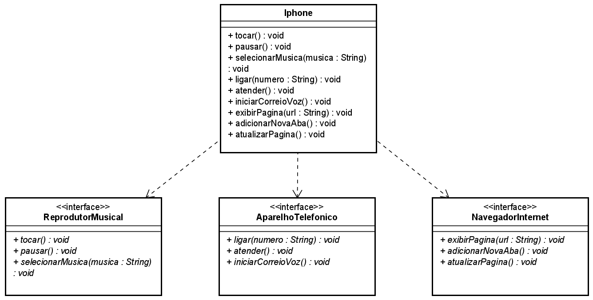

# JAVA POO :
Este repositório tem como objetivo armazenar os desafios e exercícios feitos durante o bootcamp Santander DIO na trilha de Java.

## ⭐ CONTEÚDO ESTUDADO
- Classes
- Objetos
- Pacotes
- Visibilidade de recursos e modificadores
- Getters e Setters
- Construtores
- Enums
- UML
- Encapsulamento
- Herança
- Abstração
- Polimorfismo
- Interfaces

## 💻 Desafios

### Desafio 1 - Diagrama UML Iphone

[Repositório de Explicação do Desafio](https://github.com/digitalinnovationone/trilha-java-basico/tree/main/desafios/poo)
